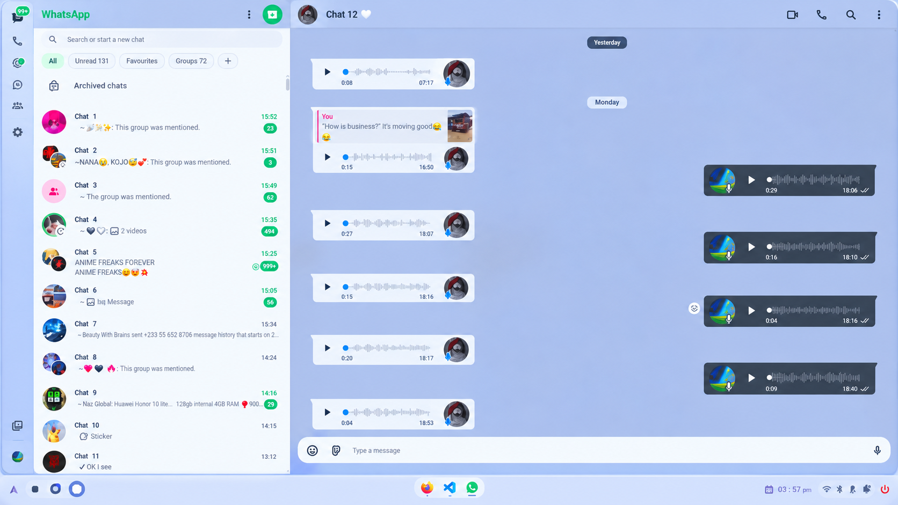
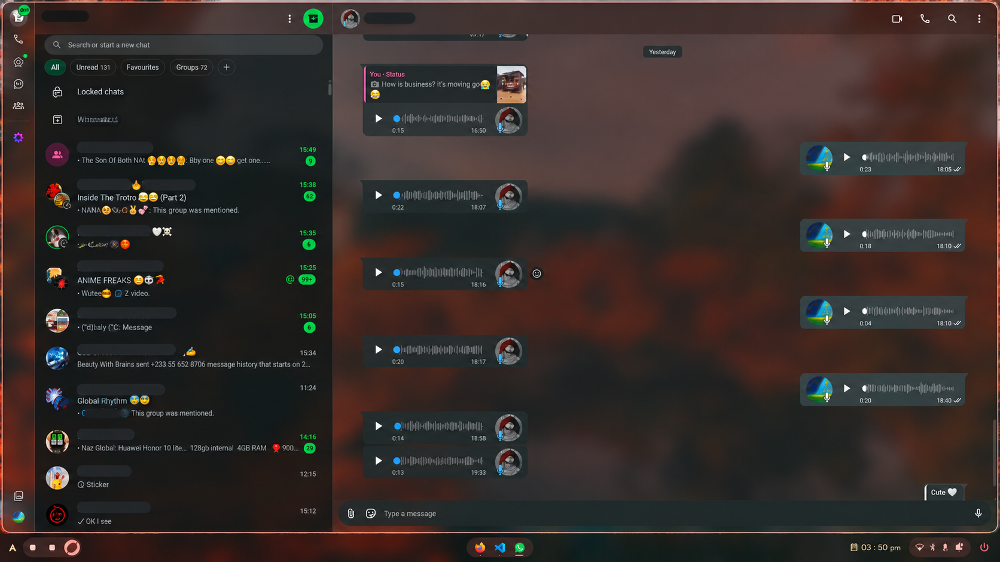

# WhatsApp Glass Native

<p align="center">
  
</p>

An Electron shell around [WhatsApp Web](https://web.whatsapp.com) that themes it from your live
[Caelestia](https://github.com/lhord-starr/Caelestia) Material 3 colour scheme — glass-morphic
panes, your own palette, and text that stays legible on every surface it's actually painted on.

> Electron embeds Chromium and that can't be swapped, so WhatsApp Web is still rendered by Blink.
> The app sends a Safari user-agent to get the build WhatsApp designed against, not WebKit
> behaviour. See [Safari identity](#safari-identity).

## Screenshots

<table>
  <tr>
    <td width="50%"></td>
    <td width="50%"></td>
  </tr>
  <tr>
    <td align="center">Light scheme</td>
    <td align="center">Dark scheme</td>
  </tr>
</table>

Both are driven by the live Caelestia scheme — nothing here is hand-picked. Switch the OS
appearance and the panes, bubbles and ink follow. See [How theming works](#how-theming-works).

## Requirements

- Node.js and npm
- A Linux desktop with a compositor (the glass effect needs the desktop wallpaper to show through)
- Optional: Caelestia installed, for automatic scheme pickup

## Install and run

```sh
npm install
npm start
```

## Icon

`assets/icon.svg` is the source of truth. Electron's `nativeImage` cannot read SVG — a path to the
vector loads as a 0×0 empty image — so the window is handed `assets/icon.png` and the raster set in
`assets/icons/`. Regenerate both after editing the source:

```sh
npm run build:icon
```

Needs `rsvg-convert` (librsvg) or `resvg` on `PATH`; the script picks whichever it finds and reports
a clear error if neither is installed. Each size is rendered at 4× and box-filtered down, because a
16px icon drawn at 16px and one downsampled from 2048px are not the same pixels.

## Tests

```sh
npm test
```

No test framework — the assertions are plain enough that a dependency would cost more than it
saves. Four suites, 112 checks:

| Suite | Covers |
| --- | --- |
| `test/palette.test.js` | Token parsing, contrast primitives, palette guarantees, the tint, the generated stylesheet, WDS token coverage, theme-leak overrides, status/media overlays, pane/glass/chat-list selector coverage |
| `test/ink.test.js` | The ink search in `buildPalette` — each token must clear its floor on *every* surface it lands on |
| `test/inject.test.js` | The stylesheet upsert survives being parsed by the page, and the Electron lifecycle wiring fires |
| `test/ua.test.js` | User-agent, `sec-ch-ua` client hints and `navigator.*` all agree on "Safari" |

`main.js` calls `app.getPath()` and reads `nativeTheme` at module scope, so it can't be `require`d
outside a real Electron process. Each suite stubs the `electron` module via `Module._load` before
loading it.

## How theming works

### Palette resolution

Light and dark mode are resolved in [`APPEARANCE.md`](APPEARANCE.md) — the tokens decide the
appearance, not the OS, and the background's own luminance has the final say. In priority order:

1. `~/.local/state/caelestia/scheme.json` — the live Material 3 scheme
2. `./colors.json` — optional hand-tweaks applied on top
3. Built-in WhatsApp defaults

Then every text token is contrast-checked against every surface it can land on, and blended until
it clears its WCAG floor. Caelestia palettes are well built, but a wallpaper-driven scheme can
still put `onSurfaceVariant` or `primary` too close to a bubble background — that's what the
palette code exists to prevent.

### Surfaces

Three stacked surfaces, from the desktop up:

| Surface | Default (dark / light) | What it is |
| --- | --- | --- |
| Page | `veil` at 74% / 86% | The app background over the blurred wallpaper |
| Panel | 45% / 62% | Sidebar, header, chat area, compose bar |
| Bubbles | 86% over the panel | Incoming and outgoing message fills |

Appearance is decided by the tokens, not the OS: the background's own luminance has the final say,
so `color-scheme` and the painted colours can never disagree.

The page's alpha has a floor it cannot argue its way under, and the floor is the AAA body-text
guarantee rather than a preference. Luminance is what the transparency budget is actually spent on:
on the live scheme a veil any more transparent than ~70% stops supporting 7:1 ink over a white
wallpaper, so the escape loop walks the alpha back up. Asking for `veil: 0.5` gets painted at 0.70.
Lower the panel and bubble alphas as far as you like — nothing about body ink constrains those — but
the page will not go past its own legibility floor without `CONTRAST.primary` coming down with it.

### Tint

Tonal palettes put almost no chroma in their neutrals. Caelestia's `dynamic` background is `130d09`
— a near-black whose channels differ by ten — and painted over a desktop wallpaper that leaves the
*wallpaper's* colour on screen rather than the scheme's. A perfectly correct palette reads as flat
neutral grey.

The obvious fix, blending toward `surfaceTint`, is not free: in a dark scheme `surfaceTint` is a
*light* colour, and raising the page's luminance is exactly what the alpha budget above is spent on.
Reaching for the tint that way costs the veil more than three quarters of its alpha before ink stops
clearing 7:1. Asking for a tint and asking for transparency turn out to be the same request.

So the tint moves hue and holds relative luminance. `tintSurface()` takes the hue from the scheme's
own `surfaceTint` (defined per mode, so the same code warms a light scheme and cools a dark one),
climbs saturation toward the gamut ceiling at the original luminance, and recovers the exact
luminance by bisection on HSL lightness — HSL lightness and WCAG luminance are different quantities,
and holding one does not hold the other.

That makes the tint free by construction rather than by luck. Every guarantee downstream is a
contrast ratio, `contrastRatio()` reads relative luminance alone, and that value is unchanged — so
panel separation, both dead-zone escapes and the ink searches all evaluate to exactly what they did
before. It is covered by a test that asserts the veil gives up no alpha at full tint, and another
that asserts every ink token is byte-identical between `tint: 0` and `tint: 1`.

Measured on rendered pixels over a saturated wallpaper, image-wide mean chroma rises 42 → 62 at the
default, and the sidebar header — the most palette-owned surface — goes from 11 to 25.

Light schemes gain less, and that is arithmetic rather than a limitation: near a fixed luminance of
white the sRGB gamut carries very little chroma, so a light scheme's veil barely moves while its
panel, lower on the ramp, does.

One surface is deliberately excluded. The tint reaches the neutrals — page, panel, incoming bubble —
but not the outgoing bubble: `primaryContainer` is already the most saturated token a tonal scheme
has, so there is nothing there to recover, and that bubble is the one place the app's own colour is
meant to survive.

### Contrast guarantees

Floors are AAA for body and bubble text, AA for supporting text:

| Token | Floor | Painted on |
| --- | --- | --- |
| `primary` | 7:1 | page, panel |
| `secondary` | 4.5:1 | page, panel |
| `onBubble` | 7:1 | both bubbles |
| `onAvatar` | 7:1 | both avatar discs (opaque) |
| `accent` | 4.5:1 | panel, outgoing bubble (read receipts, ticks) |

Three things make that hold rather than just usually hold:

- **Tokens are scoped to their real surfaces.** Body ink is checked against the page and the panel;
  bubble ink against the two painted bubbles. One search across all four would over-constrain every
  token, and when a panel is much lighter than the page behind it the two regions genuinely want
  different ink.
- **The mid-tone dead zone is escaped.** Between roughly 0.18 and 0.45 luminance neither white nor
  black ink reaches 4.5:1 — the far pole is too close. A surface in that band is pushed toward the
  page's pole *before* its ink is chosen, and the veil is then re-derived so what gets painted is
  exactly what the maths assumed.
- **The panel is pulled onto the page's side of the mid-point.** Body text is one colour on both
  surfaces, so a panel that crosses the mid-point away from the page makes the body floor
  unreachable for any single value.

The bubble fill is translucent, so ink is verified against the bubble *composited onto the panel*,
not against the opaque token — the guarantee is stated on the surface actually painted.

`onAvatar` is the one exception and has its own field for that reason. A contact's initial is drawn
on an opaque disc with no bubble alpha anywhere in the stack, so the painted-bubble reference is the
wrong one: on the live scheme the ink that clears the disc (7.02:1) measures 6.86:1 against the
painted bubble, i.e. under the AAA floor the same token is supposed to hold.

### What WhatsApp actually reads

The token names above are the older WhatsApp Web set, and current builds no longer use them for the
chat list. That subtree resolves its colour through `--WDS-*` custom properties instead — the avatar
outline, the status rings, the "seen" tick, the disappearing-messages badge and the initial-letter
discs all read those. A custom property that is never declared has no value at all, so it falls
through to WhatsApp's own cascade, which knows nothing about this palette. The result is a correctly
themed pane with stock WhatsApp colour painted on top of it.

The sheet therefore declares the WDS names the chat list references. The list is transcribed from
rendered markup rather than inferred from token names, because a property invented from a
plausible-looking name would satisfy every test while changing nothing on screen:

| WDS token | Fed from |
| --- | --- |
| `--WDS-content-deemphasized` | `secondary` |
| `--WDS-components-outline-profile-photo` | `secondary` |
| `--WDS-persistent-activity-indicator` | `secondary` |
| `--WDS-systems-status-seen` | `accentInk` |
| `--WDS-components-profile-photo-surface-green` | `outgoing` |
| `--WDS-components-profile-photo-content-green` | `onAvatar` |
| `--WDS-components-profile-photo-surface-cobalt` | `incoming` |
| `--WDS-components-profile-photo-content-cobalt` | `onAvatar` |

The two status tokens are wired to different roles because the status ring is two overlapping arcs
that separate the unviewed remainder from the viewed part; feeding both from the accent would turn a
progress ring into a solid disc. On a palette whose accent happens to resolve onto its secondary ink
they coincide and the ring reads solid — which is what WhatsApp's own ring does when its pair
matches, so they aren't forced apart.

### Chat-list selectors

The rest of the row is reached by selector, and that subtree is hostile to the rest of the sheet for
two reasons: its classes are build hashes (`x10l6tqk xh8yej3 x1g42fcv`) that turn over on every
release, and its icons are inline `<svg fill="currentColor">` with an empty class attribute, so the
blanket `[data-icon]` rule can't touch them. Supporting ink — timestamps, unread counts, mention
glyphs, the media markers in the preview line, and the preview text — is therefore keyed on
`data-testid`, which is the only handle on that subtree that has stayed put, and `currentColor` means
naming the container is enough to reach the glyphs inside it.

Five elements in and around that subtree needed naming for their own sake, and two of them looked
already covered — which is what makes them easy to miss, since the integration looks complete from the
outside and the element that isn't integrated is the one that looks covered:

- **The encryption footer** sits below the last row, so nothing in the grid rule reaches it. The
  notice is supporting ink; the link inside it is the one colour in the sidebar the host resolves on
  its own terms, since it's an `<a>`. `--teal` already maps to the accent, so on a build that routes
  links through that token the direct rule agrees with it, and on a build that doesn't it is the only
  thing pinning the hue — naming the element is what makes both land on the same ink.
- **The pane header buttons** (Locked chats, Archived) had no rule at all. Their labels measured as
  `rgb(0,0,0)` — black ink on a dark panel — because nothing named a `<button>` and the colour fell
  to the host and the UA stylesheet. They're scoped to the pane's own direct children rather than
  written as a bare `button` selector, because the composer, the attach and emoji pickers and the
  send button are all `<button>` too and each already carries ink of its own that a blanket rule
  would flatten.
- **The row context chevron** (`context-btn`, the hover menu) reads as covered and isn't. It sits
  inside `cell-frame-secondary`, which this sheet already names, but it measured `rgb(0,0,0)` while
  its parent cell was already on-token. That is the general hazard with `<button>` here, and it's
  worth stating once: the UA stylesheet puts a colour on form controls *directly*, so a declaration
  on the element beats an inherited one however specific the ancestor's selector is. Everything else
  in the chat list integrates by inheriting from a named ancestor; nothing that is a `<button>` can,
  so every one of them has to be named as a target in its own right.
- **The search field** is the same hazard one control further along, and the placeholder is a third
  thing again. The input measured `rgb(255,255,255)` — the UA's `fieldtext`, brighter than any ink in
  the palette and identical in every scheme. But `::placeholder` isn't inherited at *all*; it's its
  own UA declaration, so naming the input does nothing for it. It measured `rgb(117,117,117)`: a
  fixed grey measuring about 4.2:1 on the pane, under the 4.5:1 floor for text its size, and never
  consulting the scheme at all. It's also the only text in an empty search field, so it's the whole
  affordance. On the secondary token it measures 10.6:1. The rule is anchored to
  `chat-list-search-container` rather than written as a bare `::placeholder`, which would repaint every
  placeholder in the app including surfaces this sheet hasn't measured. Two dumps of this same field,
  from different builds, differ by two wrapper `div`s and seven classes on the container — which is
  why the anchor is the testid and every step after it is a plain descendant. A structural path like
  `> div > div input` would match on one build and silently match nothing on the next, which is the
  same quiet failure as keying on a build hash, and a test now rejects `>`, `+` and `~` in these two
  selectors for that reason.

So there are three separate ways to end up off-palette here, and they need three different fixes: an
element the sheet never names, an element the UA names instead of us (`<button>`, `<input>`), and a
pseudo-element that isn't inherited by anything.

The filter bar is the second case at its largest: five `<button>`s — All, Unread, Favourites, the
overflow chevron and the Groups entry inside it — all measured `rgb(255,255,255)`, along with every
label, both counts and the chevron. The pane-header rule doesn't reach them and shouldn't: they're
five and six levels below the pane, not directly under it.

It also needed **two** handles rather than one, which is the first time a single stable attribute
turned out not to be enough. The host wraps these inconsistently — the overflow chevron sits outside
any `filter-button` wrapper, and the Groups entry carries no `aria-controls` at all — so each handle
misses a different button. Keeping both means a rename of either still leaves the other working, which
matters because a handle that quietly stops matching is invisible until someone reports a white button
again. The test asserts both handles by name and says *which* button goes missing without each one, so
the redundancy is deliberate rather than something to be tidied up later.

The emoji in a row title are the one thing here deliberately left alone. They are sprite bitmaps: the
`` carries a 1×1 transparent GIF and the glyph itself arrives as a CSS `background-image` on
`.emoji`, positioned by inline offsets. `color` and `currentColor` have no path into a bitmap, so
there is no hue to integrate and no selector worth writing — a rule here would be inventing one for no
effect. Their `alt` text does fall back to the inherited body ink if a sprite fails to load, which is
already correct.

A test asserts that every colour the sheet emits for the chat-list subtree is a palette ink. The
failure mode here isn't a wrong hue, it's an *unnamed* element — anything the sheet doesn't name falls
through to the host or the UA, and a subtree of build-hashed classes leaves plenty of room for that
to happen without any other assertion noticing. Checking it that way catches the same class of bug as
loading the markup in a browser, without making the suite depend on one. It does not catch a *named
ancestor standing in for an unnamed descendant*, which is why the chevron is pinned separately: a
chevron selector that only works by inheritance passes every structural check and renders black.

### Scroll performance

The blur lives on the static panes, which sample the wallpaper once and cache the result. The
scrolling conversation node is a translucent overlay on top of an already-blurred pane: putting a
`backdrop-filter` on a scrolling node forces the compositor to re-run the blur every frame content
moves, which was the real cause of choppy scrolling.

Promotion hints (`translateZ(0)`) are scoped to the elements that actually scroll or are actually
on screen, rather than a blanket universal selector.

### Status and media overlays

`transform`, `backdrop-filter`, `filter`, `perspective`, `contain` and a `will-change` naming any
of them each make an element the containing block for its fixed-position descendants. WhatsApp's
status viewer is exactly a viewport-fixed overlay around a `<video>`, so one of those on an ancestor
re-anchors it — silently, because the video keeps decoding and the audio keeps playing while the
picture is never seen. WhatsApp also sends the "viewed" receipt on *open* rather than on playback,
so this presented as status registering as watched with nothing on screen.

A single `:is(...):has(video)` rule undoes all of it, over the complete set of containers the
stylesheet can reach. That completeness used to be a comment's promise and nothing more: an
`OVERLAY_CONTAINERS` list sat beside it that no rule ever read, so forgetting a container there cost
a status update playing as invisible audio with nothing to say so. It is an assertion now — every
selector carrying a blur is checked to appear in the `:has(video)` list, so the two cannot drift
apart silently.

The sidebar pane is named under both its ids, `#side` and `#pane-side`. Current builds use the
latter, and a rename like that is silent: the sheet keeps parsing, every other check still passes,
and the only symptom is that the sidebar quietly stops being glass and falls back to whatever the
host paints. Keeping both costs nothing and there is no version check to decide between them.

## Configuration

For how `followSystem` interacts with a Caelestia scheme that pins its own mode, see
[`APPEARANCE.md`](APPEARANCE.md) §5.

Create `colors.json` next to `main.js`. Every key is optional and every value is validated —
unparseable colours fall back to the scheme or the built-in default, and out-of-range numbers clamp.

```json
{
  "followSystem": true,
  "blur": 20,
  "saturate": 180,
  "veil": 0.74,
  "opacity": 0.45,
  "tint": 0.6
}
```

| Key | Type | Range | Default (dark / light) | Meaning |
| --- | --- | --- | --- | --- |
| `followSystem` | bool | — | `false` | Take the background from the OS when the scheme supplies none — see the caveat below |
| `blur` | number | 0–80 | `20` | `backdrop-filter` blur radius, px |
| `saturate` | number | 100–400 | `180` | `backdrop-filter` saturation, % |
| `tint` | number | 0–1 | `0.6` | How far the neutral surfaces climb toward the tint hue, at constant luminance |
| `tintColor` | colour | — | `scheme.surfaceTint`, else `scheme.primary` | Where the tint hue comes from |
| `veil` | number | 0–1 | `0.74` / `0.86` | Page-background opacity over the wallpaper |
| `opacity` | number | 0.05–1 | `0.45` / `0.62` | Panel opacity |
| `bg` | colour | — | `#0b0e11` / `#f0f2f5` | Page background |
| `panel` | colour | — | from the M3 elevation ladder | Panel tint; overrides the ladder |
| `incoming` | colour | — | `#202c33` / `#ffffff` | Incoming bubble fill |
| `outgoing` | colour | — | `#005c4b` / `#d9fdd3` | Outgoing bubble fill |
| `primary` | colour | — | `#e9edef` / `#111b21` | Body text |
| `secondary` | colour | — | `#aebac1` / `#667781` | Supporting text and icons |
| `accent` | colour | — | `#00a884` | Links, read receipts, send button |

Those are the **requested** values, not necessarily what gets painted. Text colours are blended
further until they clear their floor, so a `#00a884` accent on a dark scheme resolves lighter — that
is the contrast guarantee working, not the override being ignored. `opacity` is likewise adjusted by
the panel-separation repair when the requested alpha doesn't separate the panel from the page. `veil`
is the one where this bites hardest: the dead-zone escape raises it back whenever the requested alpha
would leave the page unable to support legible ink, so a value below the floor is silently corrected
rather than honoured. `tint` is always painted as asked — it holds luminance, so it has nothing to be
corrected against.

Colours accept Caelestia's bare 6-digit hex (`0f0e08`, no `#`) as the primary format, plus `#rgb`,
`#rgba`, `#rrggbb`, `#rrggbbaa`, `rgb()`, `rgba()`, and `white` / `black` / `transparent`.

#### A note on `followSystem`

The OS appearance only ever selects the **fallback** background. Resolution order is
`colors.json` → `scheme.background` → `#0b0e11` / `#f0f2f5`, and `followSystem` only affects that
last step. So it does nothing when the scheme provides a usable `background` token — set `bg`
directly if you want to force an appearance. This is deliberate: the tokens are what actually get
painted, so letting the OS pick a background the scheme's text tokens were never paired with is how
you get black text on a near-black panel.

Both files are watched, so edits apply live without a restart. Editors that replace the inode
(temp-write + rename) are covered by a poller as well as `fs.watch`.

## Safari identity

Three layers have to agree or WhatsApp sees a contradiction and may serve the wrong build:

- the navigation's user-agent string — `setUserAgent`
- the `sec-ch-ua` client hints, which advertise the real engine — rewritten in a
  `webRequest.onBeforeSendHeaders` filter, and only sent on encrypted requests
- `navigator.userAgent` inside the page — fixed by the UA string above

The hints are *rewritten* rather than removed, because some servers fall back to "no hints, assume
modern browser" when hints are absent, which is worse than an explicit Safari claim.

## Notes

- The window is `transparent` — required for the wallpaper to show through the blur.
- `nodeIntegration` is off, `contextIsolation` and `sandbox` are on. WhatsApp Web is untrusted input.
- `backgroundThrottling` is off, so a window sitting behind another one keeps compositing.
- Navigation is pinned to `web.whatsapp.com`; anything else opens in the real browser.
- `prefers-reduced-motion` is honoured.

## License

MIT